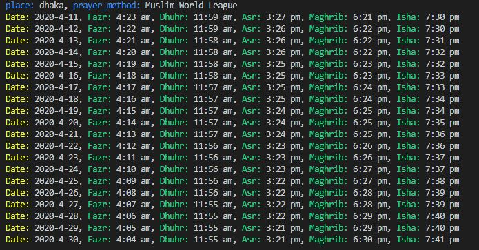

This is a small project to find the prayer time using Muslim salat api - https://rapidapi.com/muslim/api/muslim-salat/details

The color class was taken from https://stackoverflow.com/questions/8924173/how-do-i-print-bold-text-in-python

The sample output of the script given below

